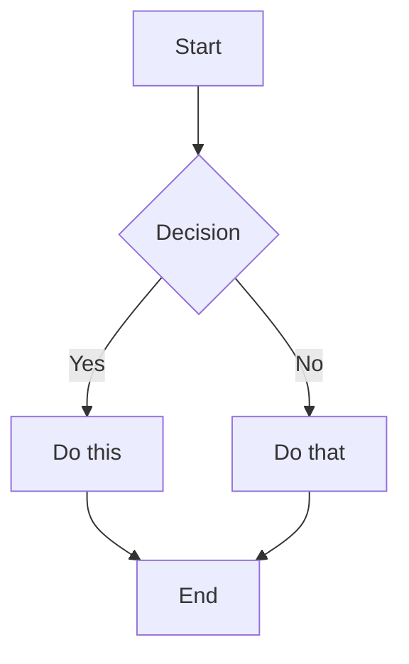

# markdown-to-pdf

A fast, reliable Markdown to PDF converter with first-class support for **Mermaid diagrams** and **LaTeX math expressions**.

## Features

- **Full Markdown support** — headings, paragraphs, lists (nested included), code blocks, blockquotes, tables, horizontal rules
- **Inline formatting preserved**: bold, italic, inline code and clickable links keep their styling in the PDF
- **Line breaks respected**: a line break in the source is a line break in the PDF, so one-sentence-per-line documents read the same
- **Mermaid diagrams** — rendered as vector SVG graphics embedded directly in the PDF
- **LaTeX math** — display math rendered via MathJax as proper typeset SVG; inline math converted to Unicode
- **Syntax-highlighted code blocks** — via highlight.js
- **Programmatic API** — use as a Node.js library or from the command line
- **TypeScript** — fully typed with declaration files included

## Installation

```bash
npm install markdown-to-pdf
```

Or install globally to use the CLI:

```bash
npm install -g markdown-to-pdf
```

## CLI Usage

```bash
md2pdf <input.md> <output.pdf> [options]
```

### Arguments

| Argument | Description |
|---|---|
| `<input.md>` | Path to the input Markdown file |
| `<output.pdf>` | Path for the generated PDF |

### Options

| Option | Description | Default |
|---|---|---|
| `--title <title>` | PDF document title | Input filename |
| `--author <author>` | PDF document author | — |
| `--font-size <size>` | Base font size in points | `12` |

### Examples

```bash
# Basic conversion
md2pdf document.md output.pdf

# With metadata
md2pdf report.md report.pdf --title "Q4 Report" --author "Jane Doe"

# Larger font
md2pdf notes.md notes.pdf --font-size 14
```

## Programmatic API

```typescript
import { generatePDF, generatePDFBuffer } from 'markdown-to-pdf';
```

### `generatePDF(markdown, outputPath, options?)`

Converts a Markdown string to a PDF file.

```typescript
await generatePDF(markdownString, './output.pdf', {
  title: 'My Document',
  author: 'Jane Doe',
  fontSize: 12,
  lineHeight: 1.6,
  margins: {
    top: 72,    // 1 inch at 72 DPI
    bottom: 72,
    left: 72,
    right: 72,
  },
});
```

### `generatePDFBuffer(markdown, options?)`

Same as `generatePDF` but returns a `Buffer` instead of writing to disk. Useful for HTTP responses or further processing.

```typescript
const buffer = await generatePDFBuffer(markdownString, { title: 'My Document' });
// e.g. in an Express route:
res.setHeader('Content-Type', 'application/pdf');
res.send(buffer);
```

### Options reference

```typescript
interface GeneratePDFOptions {
  title?: string;       // PDF metadata title
  author?: string;      // PDF metadata author
  fontSize?: number;    // Base font size in points (default: 12)
  lineHeight?: number;  // Line height multiplier (default: 1.6)
  margins?: {
    top?: number;       // Points (default: 72 = 1 inch)
    bottom?: number;
    left?: number;
    right?: number;
  };
}
```

### Additional exports

```typescript
import {
  parseMarkdown,            // Markdown → AST
  renderInlineSpans,        // Draw formatted text runs onto a PDFKit document
  splitSpansIntoLines,      // Split formatted runs on source line breaks
  renderMermaidToSVG,       // Mermaid code → { svg, height }
  latexToUnicode,           // LaTeX → Unicode string
  extractMathExpressions,   // Find $...$ / $$...$$ in text
  parseTextWithMath,        // Split text into text/math segments
  highlightCode,            // Syntax-highlight a code string
} from 'markdown-to-pdf';
```

## Supported Markdown Syntax

### Headings

```markdown
# H1 — 24pt bold
## H2 — 20pt bold
### H3 — 16pt bold
#### H4 — 14pt bold
##### H5 — 12pt bold
###### H6 — 10pt bold
```

### Inline formatting

```markdown
**bold**, *italic*, `inline code` and [links](https://example.com) are rendered
with the matching font and stay clickable in the PDF.
```

### Line breaks

A single newline inside a paragraph or list item is kept as a line break, and
`3.` starts an ordered list at three.

```markdown
First sentence on its own line.
Second sentence on its own line.
```

### Lists

```markdown
- Unordered item
- Another item
  - Nested item
  - Another nested item

1. Ordered item
   Continuation line of the same item.
2. Another item
```

### Code blocks

Fenced code blocks with optional language for syntax highlighting:

````markdown
```typescript
function greet(name: string): string {
  return `Hello, ${name}!`;
}
```
````

### Tables

Column widths follow the content, cells wrap to as many lines as they need, and
a table longer than the page repeats its header on the next one.

```markdown
| Header 1 | Header 2 | Header 3 |
|----------|----------|----------|
| Cell 1   | Cell 2   | Cell 3   |
| Cell 4   | Cell 5   | Cell 6   |
```

### Blockquotes

```markdown
> This is a blockquote.
> It can span multiple lines.
```

### Math expressions

Inline math with single `$`:

```markdown
The energy equation $E = mc^2$ changed physics.
```

Display math with double `$$` (rendered as typeset SVG):

```markdown
$$\int_0^\infty e^{-x^2}\,dx = \frac{\sqrt{\pi}}{2}$$
```

Also supported: `\(...\)` for inline and `\[...\]` for display math.

### Mermaid diagrams

````markdown

````

## Development

```bash
# Install dependencies
npm install

# Run in development mode (tsx, no build needed)
npm run dev -- input.md output.pdf

# Build TypeScript
npm run build

# Run all tests
npm test

# Interactive test UI
npm run test:ui

# Generate coverage report
npm run test:coverage
```

## Architecture

The conversion follows a pipeline:

```
Markdown string
      ↓
  parseMarkdown()       →  ParsedElement[] AST
      ↓
  renderElement()       →  dispatches by element type
      ↓
  ┌───────────────────────────────────────────┐
  │ heading    → renderHeading()              │
  │ paragraph  → renderParagraphWithMath()    │
  │ list       → renderList()                 │
  │ code       → renderCodeBlock()            │
  │ blockquote → renderBlockquote()           │
  │ table      → renderTable()                │
  │ hr         → renderHorizontalRule()       │
  │ mermaid    → renderMermaidElement()       │
  └───────────────────────────────────────────┘
      ↓
  PDFKit PDF document
```

See [ARCHITECTURE.md](docs/ARCHITECTURE.md) for a detailed breakdown of each component.

## Project structure

```
src/
├── index.ts              # Public API exports
├── types.ts              # Shared TypeScript interfaces
├── cli.ts                # CLI entry point
├── parser/
│   └── index.ts          # Markdown → AST parser
├── pdf/
│   └── generator.ts      # PDF generation pipeline
└── renderers/
    ├── standard.ts       # Headings, lists, tables, blockquotes
    ├── inline.ts         # Formatted text runs (bold / italic / code / links)
    ├── code.ts           # Syntax-highlighted code blocks
    ├── math.ts           # LaTeX math → Unicode / MathJax SVG
    └── mermaid.ts        # Mermaid diagrams → SVG

tests/
├── unit/
│   ├── parser.test.ts
│   ├── math.test.ts
│   └── standard-renderers.test.ts
└── integration/
    ├── pdf-generation.test.ts
    └── pdf-content-validation.test.ts
```

## License

ISC
