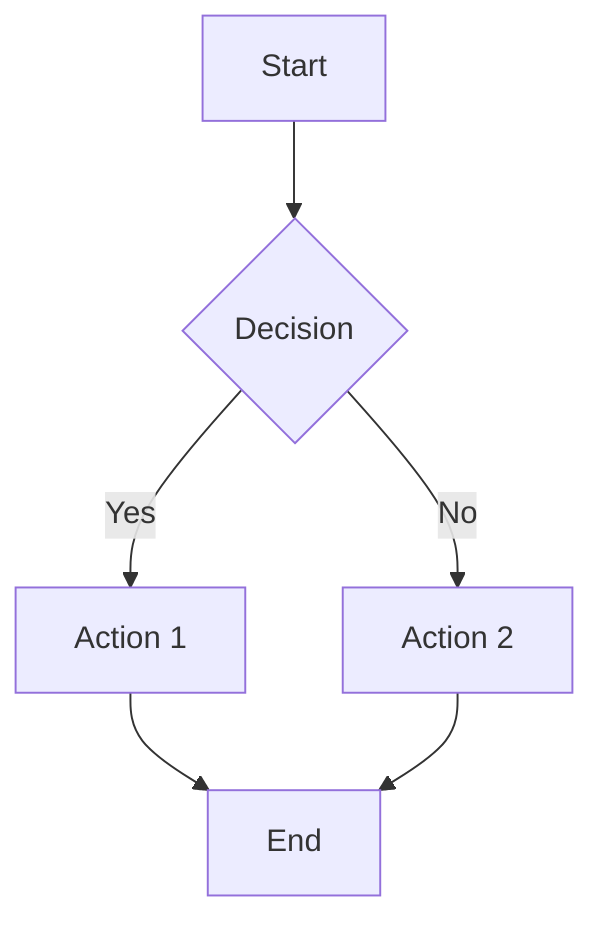

# Markdown to PDF Converter Test

This is a **fast** Markdown to PDF converter with support for:

- Mermaid diagrams
- Math expressions
- Code syntax highlighting
- Tables

## Math Support

Inline math: $E = mc^2$

Display math:
$$
\frac{-b \pm \sqrt{b^2 - 4ac}}{2a}
$$

## Code Block

```javascript
function hello(name) {
  console.log(`Hello, ${name}!`);
  return true;
}
```

## Table

| Feature | Status |
|---------|--------|
| Mermaid | ✅ |
| Math | ✅ |
| Code | ✅ |

## Mermaid Diagram



## Blockquote

> This is a blockquote with some important information.
> It can span multiple lines.

---

That's it!
